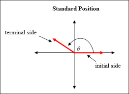

## Polar Coordinate System

#### Trigonometry Preliminaries

Initial Side
Terminal Side

 

#### Components
- The Polar Point
- Polar Axis
- A Point $P$
- Angle $\theta$
- Polar Coordinate $(r, \theta)$
- Radius $r$

$x = r \times \cos(\theta)$
$y = r \times \sin(\theta)$

 

#### Polar vs Cartesian Coordinates
 
Source:
https://xaktly.com/Images/Mathematics/PolarDerivatives/PolarCoordinatesReviewGraph.png

 