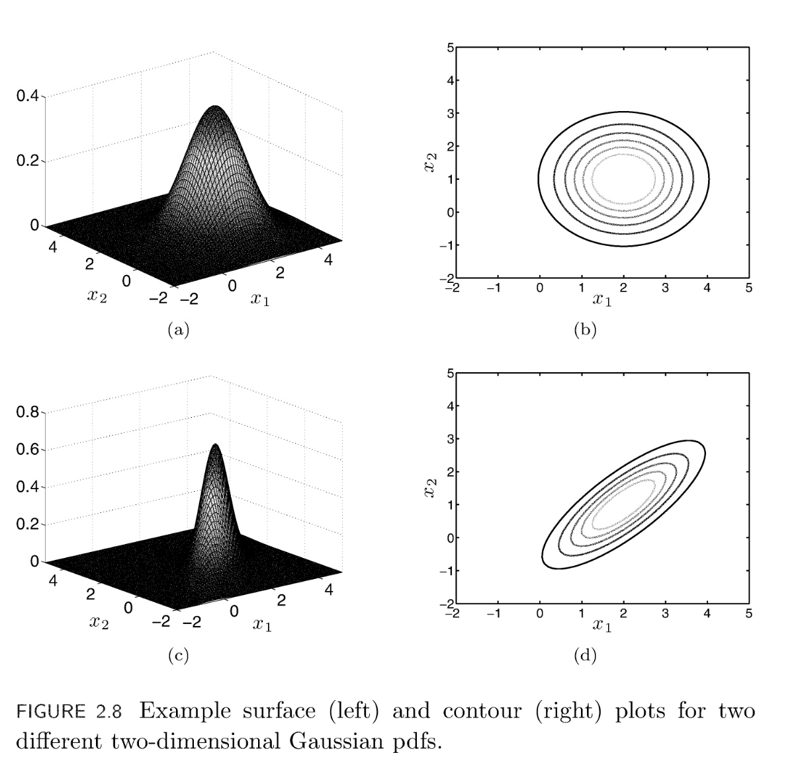

## Gaussian

$$p(y | \mu, \sigma^2) = \dfrac{1}{\sigma \sqrt{2 \pi}} \exp \Big[ \dfrac{1}{2 \sigma^2} (y-\mu)^2 \Big ]$$

or

$$p(y | \mu, \sigma^2) \sim N(\mu, \sigma^2) $$

 

Note:
- $p(y | \mu, \sigma^2)$ is maximized when $y = \mu$.

 

### Multivariate Gaussian

$$ p(\mathbf{x}) = \dfrac{1}{ (2\pi)^{D/2} \: |\mathbf{\Sigma}|^{1/2} } \exp \Big[ -\dfrac{1}{2} (x-\mathbf{\mu})^{T} \: \Sigma^{-1}  (x-\mathbf{\mu}) \Big] \quad \text{(eq. 1)} $$

or

$$ p(\mathbf{x}) = \displaystyle \prod_{d=1}^{D} \dfrac{1}{(2\pi)^{1/2}} \exp \Big[ -\dfrac{1}{2} (x_{d}-\mu_{d})^2 \Big ] \quad \text{(eq. 2)} $$

Where
- $\mathbf{x}$ is the vector of features $[ x_1, ..., x_D ]$
- $D$ is the size of $\mathbf{x}$
- $\Sigma$ is a $D \times D$ covariance matrix
- $|\mathbf{\mu}| = |\mathbf{x}|$

 

#### Deriving Eq.2 from Eq.1

Given,

- $\mu = [2, 1]^T$
- $\Sigma = \begin{bmatrix} 1 & 0 \\ 0 & 1 \end{bmatrix}$

1. Eq 1.
> &nbsp;
> $ p(\mathbf{x}) = \dfrac{1}{ (2\pi)^{D/2} \: |\mathbf{\Sigma}|^{1/2} } \exp \Big[ -\dfrac{1}{2} (\mathbf{x}-\mathbf{\mu})^{T} \: \Sigma^{-1}  (\mathbf{x}-\mathbf{\mu}) \Big]$
> &nbsp;

2. Swapping $\mathbf{\Sigma}$ by $\mathbf{I}$, by definition of identity.

> &nbsp;
> $ p(\mathbf{x}) = \dfrac{1}{ (2\pi)^{D/2} \: |\mathbf{I}|^{1/2} } \exp \Big[ -\dfrac{1}{2} (\mathbf{x}-\mathbf{\mu})^{T} \: \mathbf{I}^{-1}  (\mathbf{x}-\mathbf{\mu}) \Big]$
> &nbsp;

3. $\mathbf{I^{-1}} = \mathbf{I}$, by matrix inverse property.

> &nbsp;
> $ p(\mathbf{x}) = \dfrac{1}{ (2\pi)^{D/2} \: |\mathbf{I}|^{1/2} } \exp \Big[ -\dfrac{1}{2} (\mathbf{x}-\mathbf{\mu})^{T} \: \mathbf{I}  (\mathbf{x}-\mathbf{\mu}) \Big]$
> &nbsp;

4. Express product of terms in $\exp[...]$ as summation over $D$ elements in 

> &nbsp;
> $ p(\mathbf{x}) = \dfrac{1}{ (2\pi)^{D/2} \: |\mathbf{I}|^{1/2} } \exp \Big[ -\dfrac{1}{2} \displaystyle \sum_{d=1}^{D} (x_d - \mu_d)^2 \Big]$
> &nbsp;

5. Exponential of sum = product of exponentials

> &nbsp;
> $ p(\mathbf{x}) = \dfrac{1}{ (2\pi)^{D/2} \: |\mathbf{I}|^{1/2} } \displaystyle \prod_{d=1}^{D} \exp \Big[ -\dfrac{1}{2} \displaystyle (x_d - \mu_d)^2 \Big]$
> &nbsp;

6. Associativity and commutativity

> &nbsp;
> $ p(\mathbf{x}) = \displaystyle \prod_{d=1}^{D}  \dfrac{1}{ (2\pi)^{D/2} \: |\mathbf{I}|^{1/2} } \exp \Big[ -\dfrac{1}{2} \displaystyle (x_d - \mu_d)^2 \Big]$
> &nbsp;

 

  

References:
1. S. Rogers,..., Machine Learning Pattern Recognition