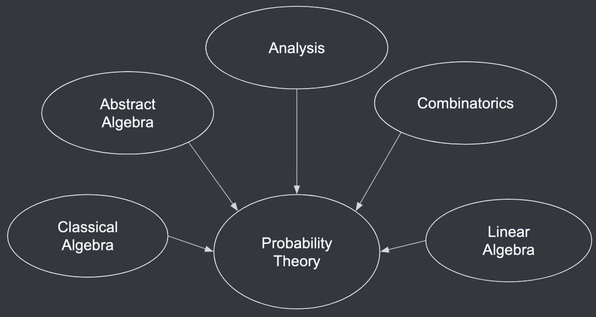

# Learning Probability Theory

The branch of mathematics central to both statistics and machine learning is probability theory. In fact, to be proficient in both statistics and machine learning is to be proficient in probability theory.

Said another way, unless you can master probability theory, you will find yourself struggling to read statistical literature.

Learning probability theory is not straightforward for many, especially for those who are not comfortable with the prerequisite subjects of reading probability theory.

Altough there are countless introductory books and courses on probability theory, it is often taken for granted that the learner is alread familiar with the prerequisites (which we'll mention in this section). 

We don't want to make that assumption here. So, here goes.

Probability theory is the branch of mathematics about uncertainty and its calculation. 

The word probability itself refers to a number between 0 and 1, the magnitude of uncertainty about some outcome. Now, when there can be multiple possible outcomes from some experiment (e.g, rolling a dice), then that probability must be distributed across all the possible ourcomes.

All of these outcomes must be...

 

