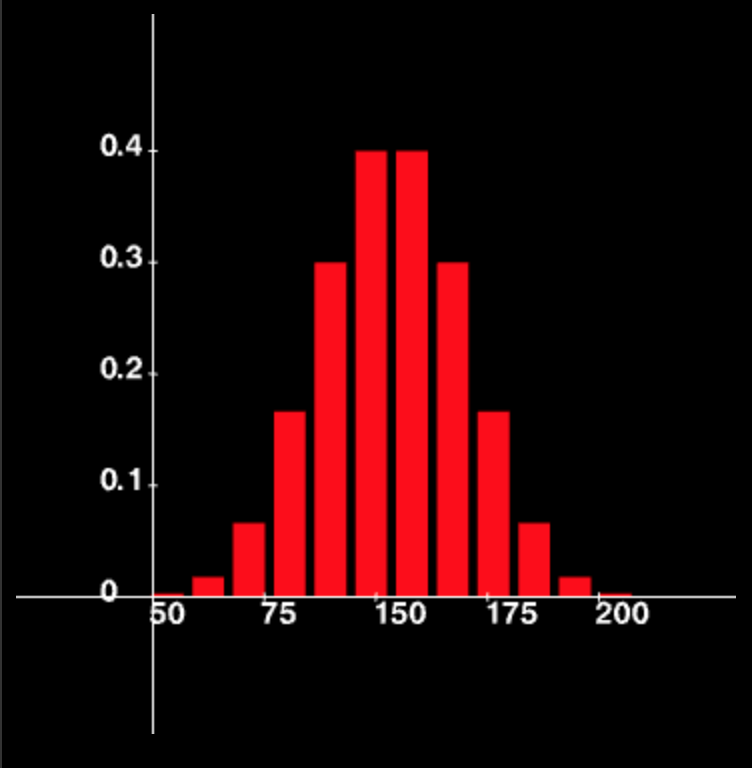
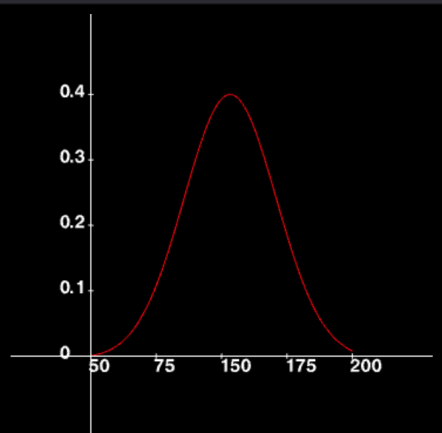

# Probability Distribution

A probability distribution is, as the name suggests, the distribution of probability across all observations.

Recall that probability is a number between 0 and 1. Therefore, in a probability distribution, all observations are assigned some fraction of 1.

 

**Discrete Probability Distribution**

**Figure 4**

 

**Continuous Probability Distribution**

**Figure 5**