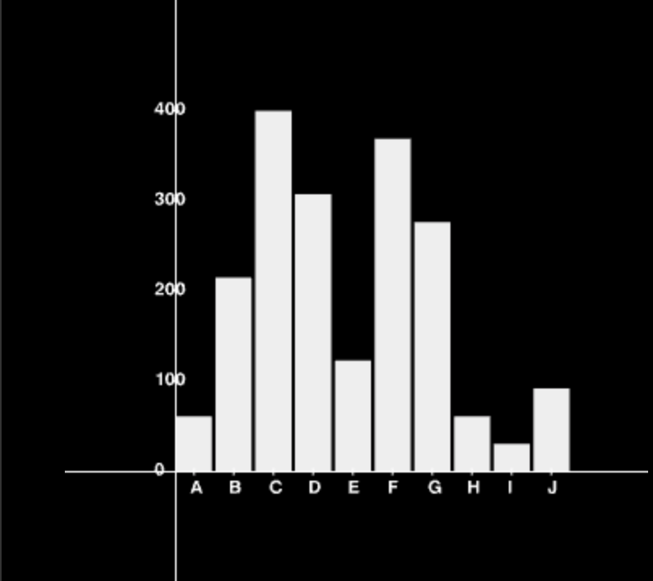

# Visualizing Distributions

Continuing our discussion about frequencies and relative frequencies, we now will look at going from a table of values to a graph.

In this section, we'll look at two types of graphs: the histogram and density plot.

There are many more types of graphs in statistics, but these two are both (1) central to probability distributions and (2) the starting point for viewing distributions before considering alternatives.

Naturally, being able to visualize data makes it easier to see patterns that comparing values in a table.

 

### Histogram

A histogram is a graphical representation of a frequency distribution (including relative frequencies).

 

As an example, have a look at Figure 1.

 

**Figure 1: Histogram**

 

The word histogram comes from the Greek words "histo" and "gram" which mean "something upright" and "something drawn", respectively.

The histogram, in summary, is a way to visualize the frequencies of a finite type of observations. In Figure 1, the x-axis is labeled with A,B,C, etc. You can imagine these to be some class of products. The y-axis, of course, is for the correpsonding frequencies of these observations.

 

### Density

When we're dealing with non-discrete number of observations, we use the word "density" instead of frequency.

Here's an example of a density plot.

 

 

**Figure 2: Density**

 

The first difference you'll notice is that we use a single curved line instead of the vertical bars. This is because a density plot is used to represent an infinite (i.e, non-discrete) number of distinct observations.

In fact, if we had a discrete number of distinct observations that were large enough in number, the histogram would start to appear smoother – like a density plot.

Try increasing the number of experiments in the figure below by dragging the slider.
 

<iframe 
    src="http://localhost:3000/HistogramAndDensity?x=2" 
    height="650" width="450"
    border=0
/>

**Figure 3**

  
