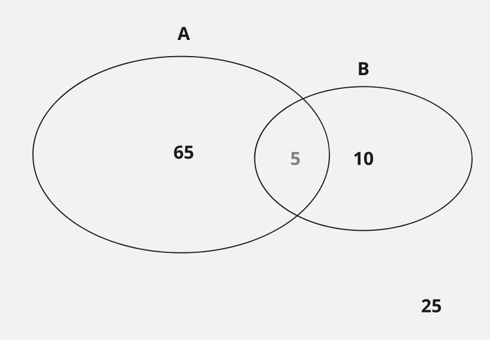

  

||A|~A|Sum|
|-|-|-|-|
|B|0.05|0.05|0.10|
|~B|0.60|0.30|0.90|
|Sum|0.65|0.35|1.00|

  

Marginal Probabilities

$ P(A) =0.65 $

$ P(B) =0.10 $

$ P(\sim A) = 0.35 $

$ P(\sim B) = 0.90 $

 

Joint Probabilities

$ P(A \cap B) = 0.05 $

$ P(A^{\complement } \cap B) = 0.05 $

$ P(A \cap B^{\complement }) = 0.60 $

$ P(A^{\complement } \cap B^{\complement }) = 0.35 $

  

Conditional Probability

>$P(A|B) = \dfrac{ P(A \cap B) }{ P(B) }$

 
 