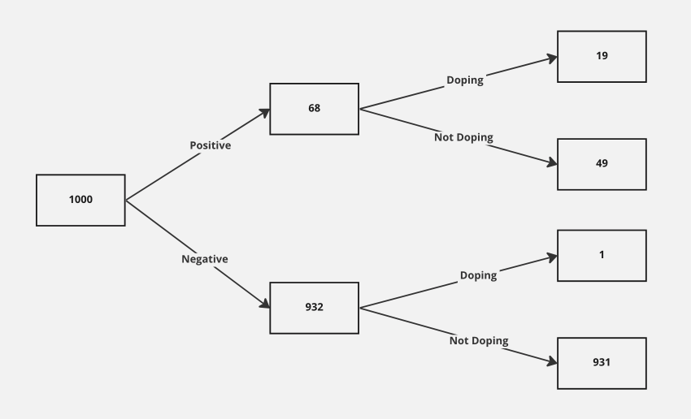

[1, pp. 308-314]

We have a screening test that is 95% accurate. We have 1000 athletes where 20 are doping and 980 are not doping. If screening test is performed and athlete tests positive, what is the probability that they are truly positive?

 

Data Tree

  

Correct positive count

> $0.95 \times 20 = 19$

Correct negative count

> $0.95 \times 980 = 931$

 

However,

Incorrect positive count
> $980 - 931 = 49$

Incorrect negative count
> $20 - 19 = 1$

 

To calculate probability of test correctness
> $\dfrac{\text{correct positive test}}{\text{all positive tests}}$

 

So, for true positive tests

> $\dfrac{19}{19 + 49} = \dfrac{19}{68} = 0.28 = 28\% $

and for false positive tests

> $\dfrac{49}{19 + 49} = \dfrac{49}{68} = 0.72 = 72\% $

  

Inverse probability (Bayesian)

  

#### Bayes Theorem

> $P(A|B) = \dfrac{ P(B|A) \times P(A) }{ P(B) }$

> $P(H_g|T_p) = \dfrac{ P(T_p|H_g) \times P(H_g) }{ P(T_p) }$

  

**Bayes Inference (Approach 1)**

||$P(T_p)$|$P(T_n)$|sum|
|-|-|-|-|
|$P(H_g)$|$\frac{19}{1000}$=0.019|$\frac{1}{1000}=0.001$|0.02|
|$P(H_i)$|$\frac{49}{1000}$=0.049|$\frac{931}{1000}=0.931$|0.98|
|sum|$\frac{68}{1000}$=0.068|$\frac{932}{1000}$=0.932|1|

 

$P(T_p \cap H_g) = 0.019$

$P(H_g) = 0.02$

$P(T_p) = 0.068$

  

> $P(\text{H}_g|\text{T}_p) = \dfrac{P(\text{T}_p | \text{H}_g) \times P(\text{H}_g)}{P(\text{T}_p)} = \dfrac{P(\text{T}_p \cap \text{H}_g)}{P(T_p)}$

> $P(\text{H}_g|\text{T}_p) = \dfrac{0.019}{0.068} = 0.28 = 28\% $

  

**Bayes Inference (Approach 2)**

> Posterior Likelihood = Odds Ratio $\times$ Likelihood Ratio

> Posterior Probability $\propto$ Odds Ratio $\times$ Likelihood Ratio 

 

Odds Ratio

> Odds Ratio $ = \dfrac {P(\text{H}_g) }{ P(\text{H}_i) } = \dfrac{\dfrac{20}{1000}}{\dfrac{980}{1000}} = \dfrac{1}{49}$

 

Likelihood Ratio 

>$P(\text{T}_p | \text{H}_g) = \dfrac{P(\text{H}_g \cap \text{T}_p)}{P(\text{H}_g)}= \dfrac{\frac{19}{1000}}{\frac{20}{1000}} = 0.95$

>$P(\text{T}_p | \text{H}_i) = \dfrac{P(\text{H}_i \cap \text{T}_p)}{P(\text{H}_i)}= \dfrac{\frac{49}{1000}}{\frac{980}{1000}} = 0.05$

> Likehood Ratio = $\dfrac {P(\text{T}_p | \text{H}_g) }{ P( \text{T}_p | \text{H}_i) } = \dfrac{0.95}{0.05} = \dfrac{19}{1}$

 

Posterior Likelihood

> Posterior Likelihood = likelihood $\times$ odds $= \dfrac{19}{49}$

 

Posterior Likelihood to Posterior Probability

>$ \dfrac{19}{49 + 19} =\dfrac{19}{68} = 0.28 = 28\% $

 
 

**References**
1. D. Speigelhalter, Art of Statistics...