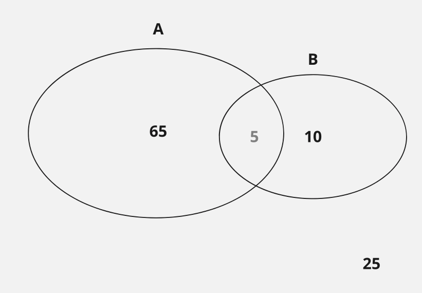
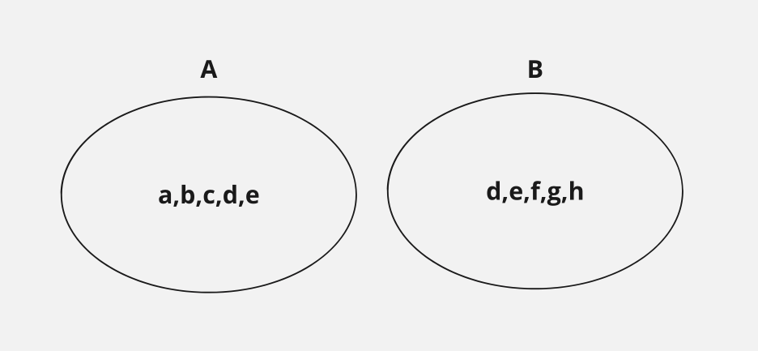

  

$|U| = 100$  
$|A| = 65$  
$|B| = 10$  

 

||A|~A|Sum|
|-|-|-|-|
|B|5|5|10|
|~B|60|30|90|
|Sum|65|35|100|

   

$|A| = 65$  
$|B| = 10$  
$|~A| = 40$  
$|~B| = 95$  
$|A \cap B| = 5$ 
$|~A \cap ~B| = 30$ 
$|A \cap ~B| = 60$ 
$|~A \cap B| = 5$
 
  

  

$U = \{ a,b,c,d,e,f,g,h,i \}$

$\sim A = \{ d,e,f,g,h,i \}$

$\sim B = \{ d,e,a,b,c,i\}$

$\sim A$ $\cap$ $\sim B = \{ d,e,i \}$

$A \cap B = \{ d,e \}$

   