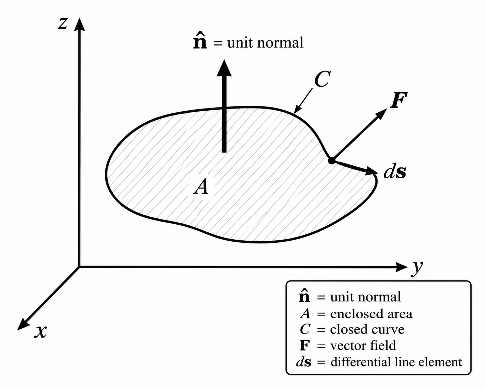
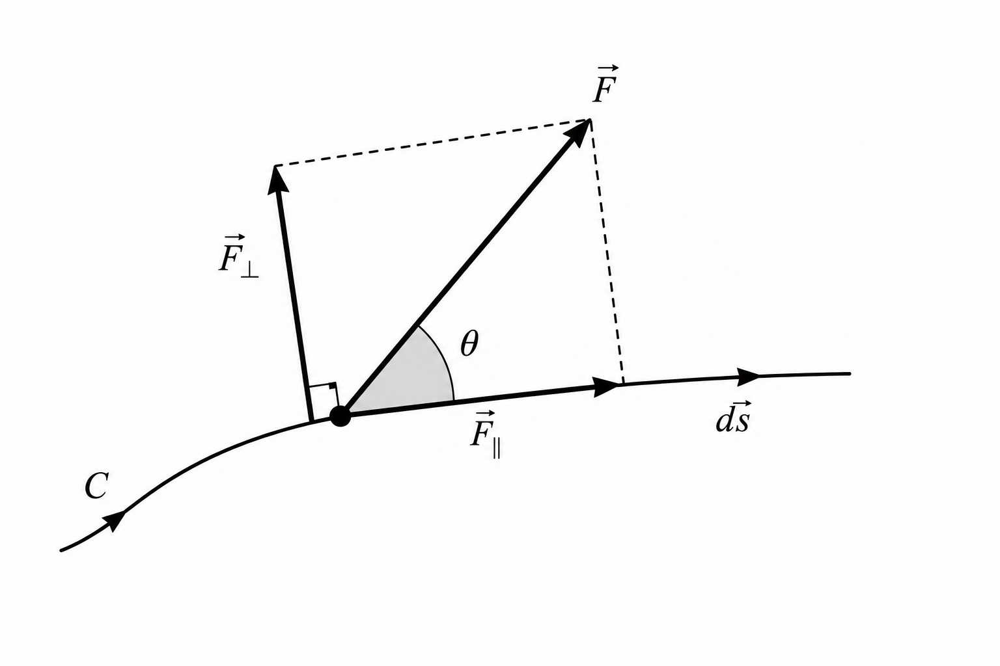

# Derivation of Curl

A derivation of the Cartesian components of curl from circulation around a vanishing rectangle.

Circulation per unit area. Curl is defined by

$$
(\nabla\times\mathbf{F})\cdot\hat{\mathbf{n}}
=
\lim_{A\to 0}
\dfrac{1}{A}
\oint_{C}\mathbf{F}\cdot d\mathbf{s}
$$

where

- $\mathbf{F}$ is a vector field.
- $\hat{\mathbf{n}}$ is the unit normal.
- $A$ is the enclosed area.
- $C$ is the closed curve.
- $d\mathbf{s}$ is the displacement along $C$.

{#fig:closed-curve-vector-field}

{#fig:vector-decomposition-along-curved-path}

Rectangular loop. Consider a rectangle in the $yz$-plane with sides $\Delta y$ and $\Delta z$ and normal along $x$. The four sides contribute, to first order,

$$
\int_{a}^{b}\mathbf{F}\cdot d\mathbf{s}
\simeq
\left(F_{y}-\dfrac{\Delta z}{2}\dfrac{\partial F_{y}}{\partial z}\right)\Delta y
$$

$$
\int_{b}^{c}\mathbf{F}\cdot d\mathbf{s}
\simeq
\left(F_{z}+\dfrac{\Delta y}{2}\dfrac{\partial F_{z}}{\partial y}\right)\Delta z
$$

$$
\int_{c}^{d}\mathbf{F}\cdot d\mathbf{s}
\simeq
-\left(F_{y}+\dfrac{\Delta z}{2}\dfrac{\partial F_{y}}{\partial z}\right)\Delta y
$$

$$
\int_{d}^{a}\mathbf{F}\cdot d\mathbf{s}
\simeq
-\left(F_{z}-\dfrac{\Delta y}{2}\dfrac{\partial F_{z}}{\partial y}\right)\Delta z
$$

Adding gives

$$
\oint_{abcd}\mathbf{F}\cdot d\mathbf{s}
\simeq
\left(\dfrac{\partial F_{z}}{\partial y}-\dfrac{\partial F_{y}}{\partial z}\right)\Delta y\,\Delta z
$$

Dividing by the area and taking the limit gives

$$
(\nabla\times\mathbf{F})_{x}
=
\dfrac{\partial F_{z}}{\partial y}
-
\dfrac{\partial F_{y}}{\partial z}
$$

Cyclic permutation gives

$$
(\nabla\times\mathbf{F})_{y}
=
\dfrac{\partial F_{x}}{\partial z}
-
\dfrac{\partial F_{z}}{\partial x}
$$

$$
(\nabla\times\mathbf{F})_{z}
=
\dfrac{\partial F_{y}}{\partial x}
-
\dfrac{\partial F_{x}}{\partial y}
$$

Therefore,

$$
\nabla\times\mathbf{F}
=
\left(\dfrac{\partial F_{z}}{\partial y}-\dfrac{\partial F_{y}}{\partial z}\right)\hat{\mathbf{x}}
+
\left(\dfrac{\partial F_{x}}{\partial z}-\dfrac{\partial F_{z}}{\partial x}\right)\hat{\mathbf{y}}
+
\left(\dfrac{\partial F_{y}}{\partial x}-\dfrac{\partial F_{x}}{\partial y}\right)\hat{\mathbf{z}}
$$

## References

1. Hughes, S. Massachusetts Institute of Technology, Department of Physics. *8.022 Spring 2005, Lecture 4*. — curl as circulation per unit area; Cartesian components from a square in the $yz$-plane by first-order Taylor expansion; cyclic permutation. <https://web.mit.edu/sahughes/www/8.022/lec04.pdf>
