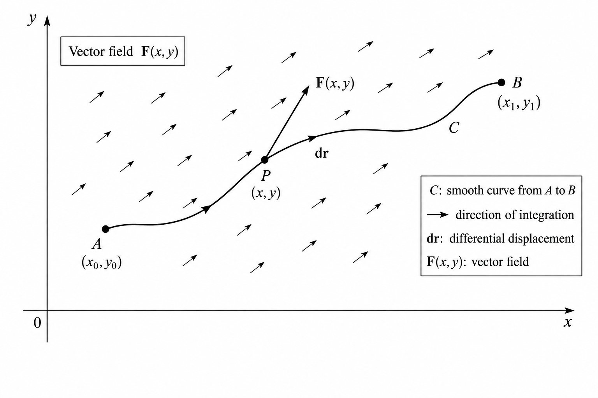

# Line Integral

A scalar obtained by integrating a field along a curve that is used to measure accumulated value along a path.

<i>

**definition [d]** (*Line Integral = Path Integral = Curve Integral*) The scalar obtained by integrating a continuous vector field $\mathbf{F}$ along a smooth curve $C$ given by $\mathbf{r}(t)$, $a \leq t \leq b$:

- $\displaystyle \int_{C} \mathbf{F} \cdot d\mathbf{r} = \int_{a}^{b} \mathbf{F}\!\bigl(\mathbf{r}(t)\bigr) \cdot \dfrac{d\mathbf{r}}{dt}(t)\, dt$ .

where

- $C$ is the path of integration.
- $\mathbf{F}$ is a vector field.
- $\mathbf{r}(t)$ is a parametrization of $C$.
- $t$ is the parameter.
- $a$ and $b$ are the parameter endpoints.
- $d\mathbf{r} = \dfrac{d\mathbf{r}}{dt}(t)\, dt$ is the infinitesimal displacement along $C$.
- $\dfrac{d\mathbf{r}}{dt}(t)$ is the tangent vector along $C$.

</i>

{#fig:line-integral}

The Riemann-sum breakdown of the line integral is

$$
\int_{C} \mathbf{F}\cdot d\mathbf{r}
=
\lim_{n\to\infty}
\sum_{i=1}^{n}
\mathbf{F}(\mathbf{r}_{i})\cdot\Delta\mathbf{r}_{i}
$$

where

- $C$ is the path of integration.
- $\mathbf{F}$ is a vector field.
- $n$ is the number of segments of $C$.
- $\mathbf{r}_{i}$ is a sample point on the $i$th segment.
- $\Delta\mathbf{r}_{i}$ is the displacement along the $i$th segment.

<i>

**definition [d]** (*Line Integral = Path Integral*) The scalar obtained by integrating a continuous scalar function $f$ with respect to arc length along a smooth curve $C$ given by $\mathbf{r}(t)$, $a \leq t \leq b$:

- $\displaystyle \int_{C} f\, ds = \int_{a}^{b} f\!\bigl(\mathbf{r}(t)\bigr)\, \left\lvert \dfrac{d\mathbf{r}}{dt}(t) \right\rvert\, dt$ .

where

- $C$ is the path of integration.
- $f$ is a scalar function.
- $\mathbf{r}(t)$ is a parametrization of $C$.
- $t$ is the parameter.
- $a$ and $b$ are the parameter endpoints.
- $ds = \left\lvert \dfrac{d\mathbf{r}}{dt}(t) \right\rvert\, dt$ is the arc-length element.
- $\dfrac{d\mathbf{r}}{dt}(t)$ is the tangent vector along $C$.

</i>

## References

1. Stewart, J. *Calculus*. — arc length $L = \int_{a}^{b} \left\lvert \dfrac{d\mathbf{r}}{dt}(t) \right\rvert\, dt$; line / path integrals (closest indexed material; dedicated line-integral chapter not fully excerpted in the notebook).
2. Kreyszig, E. *Advanced Engineering Mathematics*, 10th ed. Wiley, 2011. — line / curve integral.
3. Riley, K. F., Hobson, M. P., & Bence, S. J. *Mathematical Methods for Physics and Engineering*. Cambridge University Press, 2006. — path integral / work integral.
