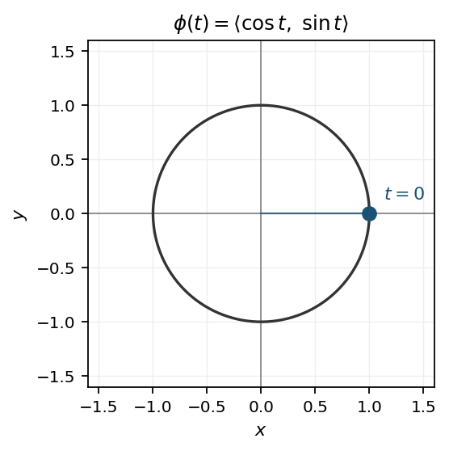
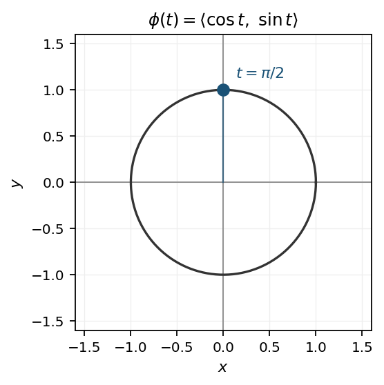
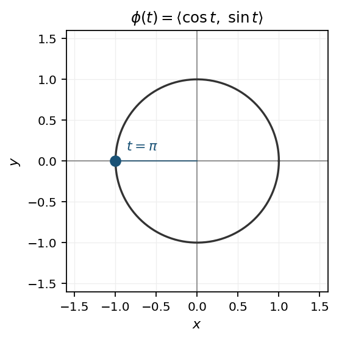
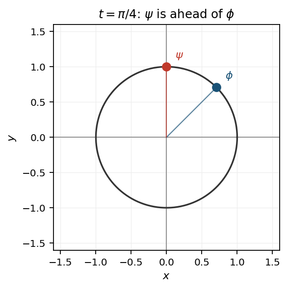

# Parameterization

A function that labels points of a curve by a real parameter that is used to write coordinates along the curve.

An implicit equation gives a constraint on points; parameterization instead gives a rule that generates each point on the curve.

For example:

$$
x^2+y^2=1
$$

versus
$$
x=\cos t,\qquad y=\sin t.$$

The first describes which points belong to the circle. The second tells you how to move through those points.

<i>

**definition [d]** (*Parameterization = Parametrization = Parametric Representation*) A continuous vector-valued function that traces a curve $C$ as the parameter varies over an interval $I$:

- $\mathbf{r}(t) = \langle f(t),\, g(t),\, h(t) \rangle$ , \quad $t \in I$ .

where

- $\mathbf{r}(t)$ is the position vector of a point on $C$.
- $C$ is the curve being traced.
- $f, g, h$ are continuous real-valued functions on $I$.
- $t$ is the parameter.
- $I$ is the parameter interval.

Note:

- a given curve admits many different parameterizations; speed and direction may differ.

</i>

<i>

**definition [d]** (*Parameterization = Parametrization = Parametric Form*) A description of a curve by expressing its coordinates as continuous functions of a single parameter $t \in I$:

- $x = f(t)$, \quad $y = g(t)$, \quad $z = h(t)$ .

where

- $f, g, h$ are continuous real-valued functions on $I$.
- $t$ is the parameter.
- $I$ is the parameter interval.
- $x, y, z$ are coordinates of a point on the curve.

Note:

- as $t$ increases, the point $(f(t), g(t), h(t))$ moves along the curve with a definite orientation.

</i>

## Elementary Example

### Simple

A line in the plane labeled by three parameter values.

$$
\mathbf{r} : I \rightarrow \mathbb{R}^{2}
$$

$$
I = \{ 0,\ 1,\ 2 \}
$$

$$
\mathbf{r}(t) = \langle t,\ 2t \rangle
$$

$$
\mathbf{r}(0) = \langle 0,\ 0 \rangle,\quad \mathbf{r}(1) = \langle 1,\ 2 \rangle,\quad \mathbf{r}(2) = \langle 2,\ 4 \rangle
$$

where

- $\mathbf{r}$ is the parameterization.
- $I$ is the set of parameter values.
- $t$ is the parameter.

### General

A unit circle in the plane labeled by a continuous parameter, with sample points and a second parameterization of the same curve.

$$
\phi : [0, 2\pi) \rightarrow \mathbb{R}^{2}
$$

$$
\phi(t) = \langle \cos t,\ \sin t \rangle
$$

$$
x = \cos t,\quad y = \sin t
$$

$$
\phi(0) = \langle 1,\ 0 \rangle,\quad \phi\!\left(\dfrac{\pi}{2}\right) = \langle 0,\ 1 \rangle,\quad \phi(\pi) = \langle -1,\ 0 \rangle
$$

The same circle admits another parameterization that traverses it twice as fast. Every point on the unit circle still has the form $\langle \cos\theta,\ \sin\theta \rangle$ for some angle $\theta$.

$$
\psi : [0, \pi) \rightarrow \mathbb{R}^{2}
$$

To finish one full lap while $t$ runs only through $[0, \pi)$, the angle must advance twice as fast, so $\theta = 2t$. Substituting that angle into the same cosine and sine form gives

$$
\psi(t) = \langle \cos 2t,\ \sin 2t \rangle
$$

so $\phi$ and $\psi$ share the same image while differing in speed. At the same parameter value $t=\pi/4$, the point $\psi(t)$ has already advanced farther around the circle than $\phi(t)$.

where

- $\phi$ is a parameterization of the unit circle.
- $\psi$ is another parameterization of the same circle.
- $t$ is the parameter.
- $\theta$ is the angle used inside cosine and sine.
- $[0, 2\pi)$ and $[0, \pi)$ are the parameter intervals.
- $x$ and $y$ are coordinates of a point on the curve.
- the image of $\phi$ and of $\psi$ is the circle of radius $1$.

## References

1. Stewart, J. *Calculus*. — parametrization via $\mathbf{r}(t)$ and parametric equations $x=f(t)$, $y=g(t)$, $z=h(t)$.
2. Bachman, D. *A Geometric Approach to Differential Forms*. Birkhäuser, 2012. — $\phi(t)=(\cos t,\sin t)$ for $0\leq t<2\pi$; also $\psi(t)=(\cos 2t,\sin 2t)$ for the same circle at twice the speed.
