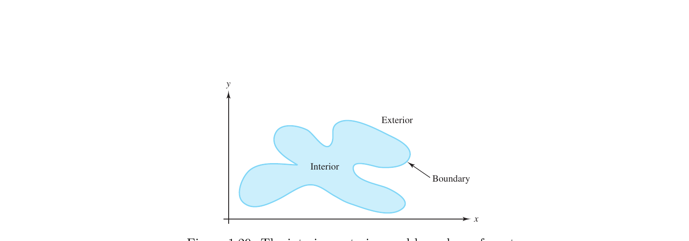

# Edge of a Domain

A set of elements that surrounds a domain as its lower-dimensional edge that is used to evaluate a definite integral of a mapping along that edge.

Note: Also called boundary. Also called perimeter of a surface.

<i>

**definition [d]** (*Edge of a Domain = Boundary = $\partial D$*) From Emam: an open manifold is surrounded by a boundary, which is itself a manifold of dimension one less. A surface such as a plane is surrounded by a curve called the edge. The boundary of a manifold $M^{n}$ is written

- $\partial M^{n} = M^{n-1}$ .

where

- $M^{n}$ is an $n$-dimensional manifold.
- $\partial M^{n}$ is its edge.
- a closed manifold such as a circle or a sphere has empty boundary, written $\partial M = 0$ in Emam’s notation.

</i>

<i>

**definition [d]** (*Edge of a Domain = Boundary = Perimeter*) From Arfken and Griffiths, in the setting of integral theorems: if $R$ is a region of integration of dimension $p$, then $R$ has a boundary denoted $\partial R$ of dimension $p-1$. For a surface, the edge is the perimeter bounding the surface. For a volume, the edge is the surface that bounds the volume.

where

- $R$ is the domain of integration.
- $\partial R$ is the edge of the domain.
- for Stokes’ theorem on a surface patch $S$, the edge is the perimeter $P$ of the patch.

</i>

<i>

**definition [d]** (*Edge of a Domain = Manifold Boundary*) From Lee: if $M$ is an $n$-manifold with boundary, a point $p \in M$ is a boundary point of $M$ if it is in the domain of a boundary chart that takes $p$ to $\partial \mathbb{H}^{n}$. The boundary of $M$, denoted $\partial M$, is the set of all its boundary points.

where

- $M$ is an $n$-manifold with boundary.
- $\partial M$ is the edge of $M$.
- $\mathbb{H}^{n}$ is the closed upper half-space.

</i>

## Examples

<i>

**example 1 [d]** (**Upper half-space** — Lee, *Introduction to Smooth Manifolds*) Verbatim from the source: the closed $n$-dimensional upper half-space $\mathbb{H}^{n} \subset \mathbb{R}^{n}$ is defined as

- $\mathbb{H}^{n} = \{ (x_{1},\ldots,x_{n}) \in \mathbb{R}^{n} : x_{n} \ge 0 \}$ .

When $n > 0$,

- $\operatorname{Int} \mathbb{H}^{n} = \{ (x_{1},\ldots,x_{n}) \in \mathbb{R}^{n} : x_{n} > 0 \}$
- $\partial \mathbb{H}^{n} = \{ (x_{1},\ldots,x_{n}) \in \mathbb{R}^{n} : x_{n} = 0 \}$ .

where

- $\mathbb{H}^{n}$ is the domain in this example.
- $\partial \mathbb{H}^{n}$ is the edge of that domain.
- $\operatorname{Int} \mathbb{H}^{n}$ is the set of interior points of $\mathbb{H}^{n}$.
- $(x_{1},\ldots,x_{n})$ is a point of $\mathbb{R}^{n}$.
- $x_{n}$ is a real number.
- $n$ is a natural number with $n > 0$.

</i>

<i>

**example 2 [d]** (**Open unit disc** — Rudin, *Real and Complex Analysis*) Verbatim from the source:

- $D(a;r) = \{ z : |z - a| < r \}$ is the open circular disc with center at $a$ and radius $r$.
- The open unit disc $D(0;1)$ is denoted by $U$.
- The unit circle, the boundary of $U$ in the complex plane, is denoted by $T$.
- $T := \{ z \in \mathbb{C} : |z| = 1 \}$ .

where

- $U = D(0;1)$ is the domain.
- $T = \partial U$ is the edge of that domain.
- $z$ is a complex number.
- $a$ is a complex number.
- $r$ is a positive real number.
- $|z - a|$ is the distance from $z$ to $a$.

</i>

{#fig:howell-1.29-edge-of-domain}

Figure 1.29 from Howell and Mathews shows a domain as a shaded interior, its edge as the labeled boundary curve, and the complementary exterior of the set.

## Elementary Example
### Simple

The edge $\partial D$ is the lower-dimensional set surrounding a domain $D$.

$$
D = \{ a,\ b,\ c,\ d \}
$$

$$
\partial D = \{ x,\ y,\ z \}
$$

where

- $D$ is the domain.
- $\partial D$ is the edge of $D$.

### General

For the open unit disc, the domain is the open set of radii less than $1$, and the edge is the unit circle.

$$
U = \{ z \in \mathbb{C} : |z| < 1 \}
$$

$$
T = \partial U = \{ z \in \mathbb{C} : |z| = 1 \}
$$

where

- $U$ is the open unit disc.
- $T$ is the unit circle, the edge of $U$.
- $|z|$ is the modulus of the complex number $z$.

## Historical Notes

The symbol $\partial$ was introduced by Carl Gustav Jacob Jacobi in the 1820s for partial derivatives, replacing an earlier upright $d$ in that role. The same glyph was later used for the boundary of a domain or manifold, written $\partial D$ or $\partial M$.

Emam explains the notation choice by an intuitive differentiation analogy: the volume of a ball of radius $r$ is $\dfrac{4}{3}\pi r^{3}$, and the area of its bounding sphere is $4\pi r^{2}$, which is the derivative of that volume with respect to $r$. One therefore writes the bounding surface as related to the solid by differentiation, suggesting $M^{2} = \partial M^{3}$. Emam stresses that this example is not to be taken literally, but that it explains the origins of using a derivative symbol for the relation between a manifold and its edge. He also notes that $\partial$ is treated as a nilpotent operator, with $\partial^{2} = 0$.

In the setting of Stokes’s theorem, the Princeton Companion records that
$\int_{S} d\omega = \int_{\partial S} \omega$,
and that one may view differentiation $\omega \mapsto d\omega$ as the adjoint of the boundary operation. Frankel likewise remarks that $\partial^{2} = 0$ mirrors $d^{2} = 0$ for differential forms. Historically, Betti in the 1870s and Poincaré in *Analysis situs* (1895) developed the systematic use of boundaries to detect holes, leading to the modern boundary operator on chains.

## References

1. Emam, M. H. *Covariant Physics*. Oxford University Press, 2021. — boundary as edge of an open manifold; $\partial M^{n} = M^{n-1}$; why $\partial$ is used as a derivative-like symbol; $\partial^{2}=0$.
2. Arfken, G. B., Weber, H. J., & Harris, F. E. *Mathematical Methods for Physicists*, 7th ed. — perimeter bounding a surface; $\partial R$ of dimension $p-1$.
3. Griffiths, D. J. *Introduction to Electrodynamics*. Cambridge University Press, 2024. — perimeter of a surface patch; soap-film wire-loop boundary.
4. Lee, J. M. *Introduction to Topological Manifolds*. Springer. — manifold boundary $\partial M$.
5. Lee, J. M. *Introduction to Smooth Manifolds*. Springer, 2013. — $\mathbb{H}^{n}$ and $\partial \mathbb{H}^{n}$ as sets.
6. Rudin, W. *Real and Complex Analysis*. McGraw-Hill, 1987. — open unit disc $U$ with boundary $T$.
7. Waters, T. *The Four Corners of Mathematics*. A K Peters / CRC Press, 2024. — Jacobi introduces $\partial$ for partial derivatives in the 1820s; Betti and Poincaré on boundaries.
8. Gowers, T., Barrow-Green, J., & Leader, I. (eds.). *The Princeton Companion to Mathematics*. Princeton University Press, 2008. — Stokes: differentiation as adjoint of the boundary operation.
9. Frankel, T. *The Geometry of Physics*. Cambridge University Press. — $\partial^{2}=0$ analogous to $d^{2}=0$.
10. Howell, R. W., & Mathews, J. H. *Complex Analysis*. https://complexanalysis.org/howell-complex-analysis-web.pdf — Figure 1.29, interior, exterior, and boundary of a set.
