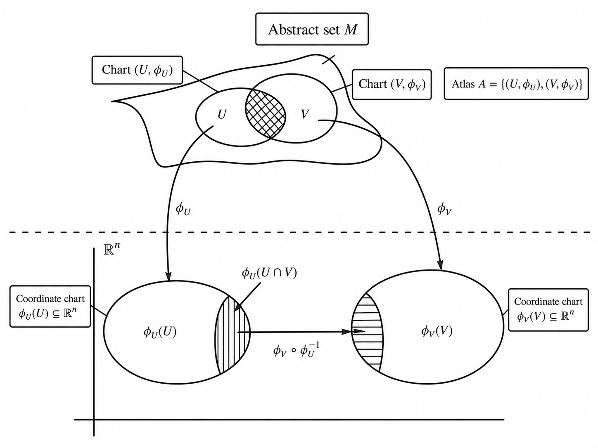

# Exterior Algebra and Exterior Derivatives

Exterior algebra and exterior differentiation extend linear algebra and calculus for manifolds. Exterior algebra is the algebra of alternating tensors; exterior differentiation is the differentiation of differential forms—which assign alternating multilinear functions to points on manifolds.

It is required to extend linear algebra and calculus for manifolds because manifolds are only locally Euclidean. That is to say, Euclidean geometric axioms apply only to local regions of a manifold.

Consider [Figure 1](#fig:atlas-charts).

{#fig:atlas-charts}

Exterior dertivatives are differential operators.