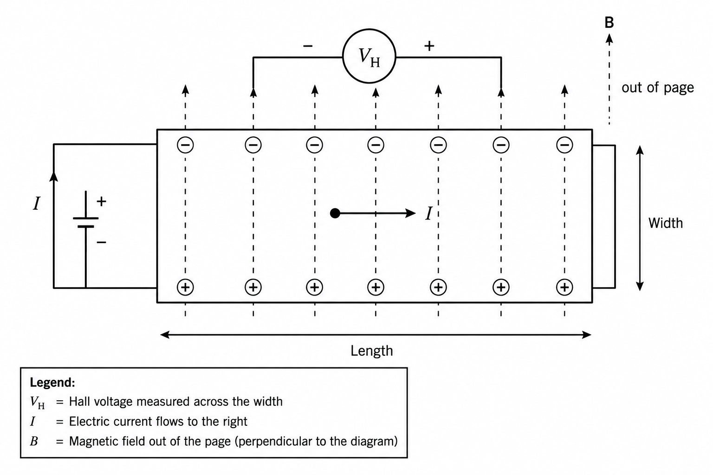

# Hall Effect

A transverse voltage across a current-carrying conductor in a magnetic field that is used to measure the sign and density of the charge carriers, where a charge carrier is a particle that carries electric charge.

The Hall force balance. A magnetic field deflects drifting carriers to one side of the conductor until the resulting electric field balances the magnetic force. This principle is used to explain the appearance of a transverse Hall voltage.

The hall effect works as follows.

1. An electric field pushes electric charges along a conducting material while a magnetic field crosses their path.
2. The magnetic field pushes the moving charges sideways.
3. Charges build up on one side, leaving the opposite side with the opposite charge.
4. This separation creates an electric field across the material and a voltage called the Hall voltage.
5. Eventually, the electric force exactly balances the magnetic force, so the charges stop moving sideways.

{#fig:hall-effect}

The balance of electric and magnetic forces is

$$
qE_{H} = qv_{d}B
$$

where

- $q$ is the carrier charge.
- $E_{H}$ is the Hall electric field.
- $v_{d}$ is the drift speed.
- $B$ is the magnetic field perpendicular to the current.

The Hall field. The Hall field is related to the current density and the carrier density. This principle is used to extract $n$ from a measured Hall voltage.

The Hall field is

$$
E_{H} = \dfrac{JB}{nq}
$$

where

- $E_{H}$ is the Hall electric field.
- $J$ is the current density.
- $B$ is the magnetic field.
- $n$ is the number of carriers per unit volume.
- $q$ is the carrier charge.

The sign of the Hall voltage. The sign of the Hall voltage reveals the sign of the carriers. This principle is used to distinguish electron conduction from hole conduction.

The Hall voltage across a strip of width $w$ is

$$
V_{H} = E_{H}w
$$

where

- $V_{H}$ is the Hall voltage.
- $E_{H}$ is the Hall electric field.
- $w$ is the width of the strip.

## References

1. Griffiths, D. J. *Introduction to Electrodynamics*. Cambridge University Press, 2024. §5.1.3 — Hall effect.
2. Knight, R. D. *Physics for Scientists and Engineers: A Strategic Approach with Modern Physics*. Pearson, 2023. — Hall voltage.
