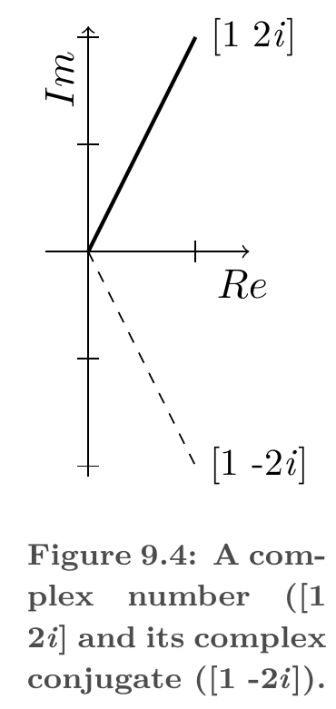

# Complex Conjugate

A mapping that maps a complex number to its conjugate value that is used to form real norms from complex scalars.

Complex conjugation of complex numbers produces real, non-negative values. This is useful for measuring lengths in complex vector spaces, such as Hilbert spaces. Complex conjugation can be applied to both complex numbers and complex vectors.
<i>

**definition [d]** (*Complex Conjugate = Conjugate*) A map $\;\bar{\;\cdot\;}: \mathbb{C} \rightarrow \mathbb{C}$ that flips the imaginary part of a complex number:

- $\overline{a + bi} = a - bi$ .

where

- $a, b \in \mathbb{R}$.
- $i$ is the imaginary unit, $i^2 = -1$.

</i>

{#fig:complex-conjugate-argand}

## Elementary Example
### Simple

Complex conjugation flips the sign of the imaginary part.

$$
z = a + bi
$$

$$
\overline{z} = a - bi
$$

$$
z = 2 + 3i,\quad \overline{z} = 2 - 3i
$$

where

- $a, b$ are real numbers.
- $i$ is the imaginary unit with $i^{2} = -1$.
- $\overline{z}$ is the complex conjugate of $z$.

### General

Conjugation acts entrywise on a vector of complex numbers.

$$
v = (1+i,\ 2-3i,\ -i)
$$

$$
\overline{v} = (1-i,\ 2+3i,\ i)
$$

where

- $\overline{v}$ is the vector of conjugated components.

## References

1. Arfken, G. B., Weber, H. J., & Harris, F. E. *Mathematical Methods for Physicists*, 7th ed. Elsevier / Academic Press, 2013. — definition.
2. Cohen, M. X. *Linear Algebra: Theory, Intuition, Code*. Sincxpress BV, 2021. — definition; Figure 9.4, p. 245.
