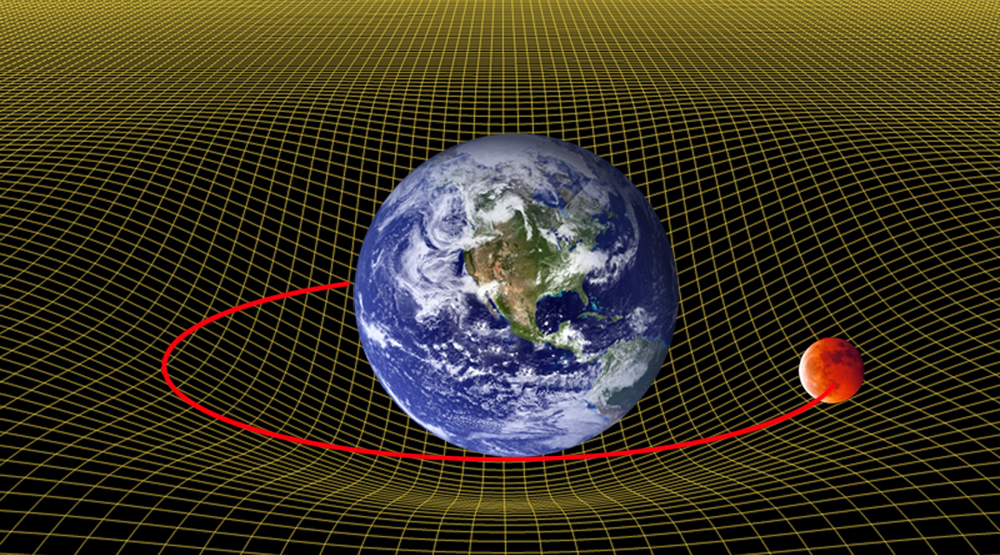
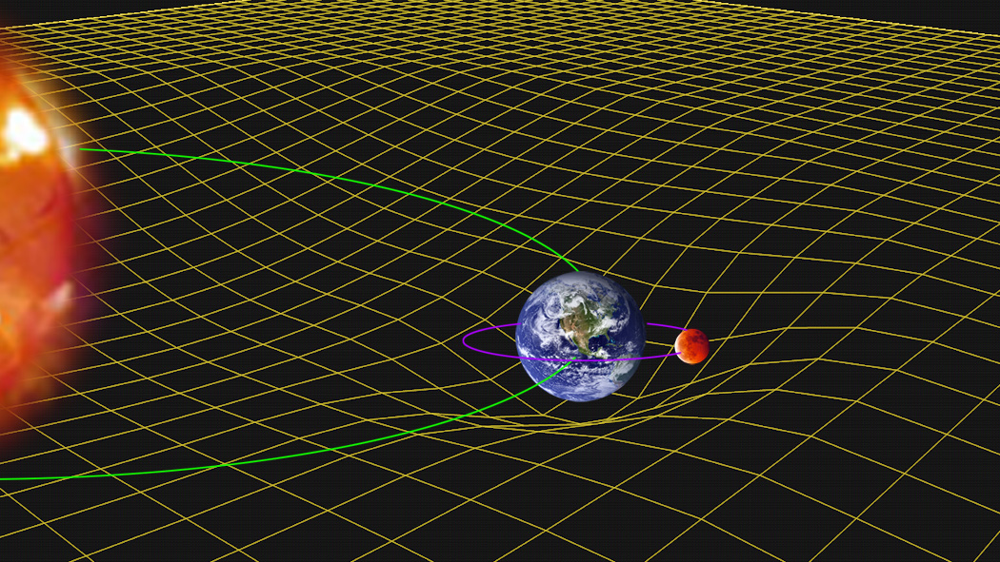

# Visualization of Spacetime

A picture of curved spacetime that is used to show how mass warps the fabric of space and time so that nearby matter follows that curve.

Note: Also called a rubber-sheet model of gravity. Also called a spacetime embedding diagram.

{#fig:gpb-curved-spacetime-earth-moon}

Earth sits in a deep dip of the spacetime grid, and the Moon follows a closed path around that curve.

{#fig:gpb-curved-spacetime-sun-earth-moon}

The Sun warps spacetime across the solar system, while Earth and the Moon sit in smaller dips inside that larger curve.

## From the Gravity Probe B Guide

In Einstein’s general theory of relativity, spacetime is a four-dimensional structure whose shape is curved and twisted by the presence and motion of matter and energy. Mass warps the fabric of spacetime in a manner similar to a bowling ball warping a spandex sheet. A smaller mass near a larger mass is not pulled by a distant force; it follows the structure of curved spacetime near the larger mass. Planets orbiting the Sun follow the curvature of spacetime produced by the Sun.

## References

1. Range, S. K. *Educator’s Guide to Gravity Probe B: Investigating Einstein’s Spacetime with Gyroscopes*. Stanford University / NASA, 2004 (HQ PDF, 2008). Page 10. Public domain. [PDF](https://einstein.stanford.edu/content/education/GP-B_T-Guide4-2008-HQ.pdf)
