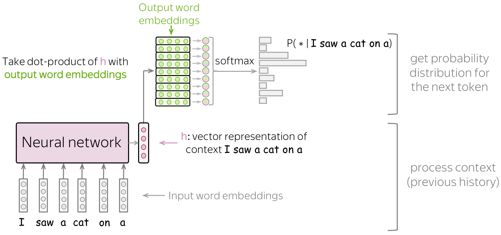

# LLMs
$\qquad$ An language model is a probability distribution, 
$$
LM \sim p(x_1,...,x_L)
$$

where
$x_i$ is the $i$th word

For example, P(the, mouse, ate, the, cheese) = 0.02

 

$\qquad$ Current LLMs are autoregressive models. I.e,

$$
p(x_1,...,x_L) = p(x_1) \times p(x_1 | x_2)  \times  p(x_2 | x_2, x_1)...p(x_n | x_{n-1}, x_{n-2},...,x_1)
$$

where
- $p(x_i)$ is the probability of any $i$th word
- $p(x_i | x_{i-1})$ is the conditional probability of any $x_i$ word given the probability of the word preceeding it, $x_{i-1}$.

Note that with AR LLMs, the generative process is $O(L)$, where $L$ is the length of the sentence. Why? Because the probability of every word is conditioned on the probability of the word preceeding it. Thus, the algorithm must iterate over all words to compute each of their conditional probabilities.

 

$\qquad$ The role of the LLM is to generate the next word. Consider this example.

Let 
- $NN: \text{words} \rightarrow \text{vector}$ be the neural network
- $LL: \text{vector} \rightarrow \text{vector}_d$ be the linear layer
- $S: \text{vector}_d \rightarrow P(* | \text{words})$ be the softmax function

**Figure 1**

$$
\begin{equation}
\max_i \displaystyle\prod_i p(x_i \mid x_{1:i-1}) \equiv \min_i \left(-\sum_i \log p(x_i \mid x_{1:i-1})\right)\equiv \min \mathcal{L}(x_{i:\mathcal{L}})
\end{equation}
$$

where
- $\max_i \displaystyle\prod_i p(x_i \mid x_{1:i-1})$ is the MLE   
- $\min_i \left(-\sum_i \log p(x_i \mid x_{1:i-1})\right)$ is the Negative Log-Likelihood   
- $\min \mathcal{L}(x_{i:\mathcal{L}})$ is the minimized loss function

 

Note! In the equality chain $(1)$, I have substituted $=$ with $\equiv$ to indicate that these functions are equivalent and not equal; which is to say they are conceptually 

Logarithms make it easier and precise to computationally aggregate probabilities. Since computers round numners, and probabilities can become very smaller proportionally as the dimensions of data get bigger, rounding error can cause a small probability to incorrectly equal zero.

But when we do use logarithms, the sign of the resultant logarithm is negative. For example, $\log(0.5) = -0.30103$. In the Negative Log-Likelihood, we flip the sign of the summation by multipling by $-1$. That is why the negative sign exists.

## References
1. https://www.youtube.com/watch?v=9vM4p9NN0Ts